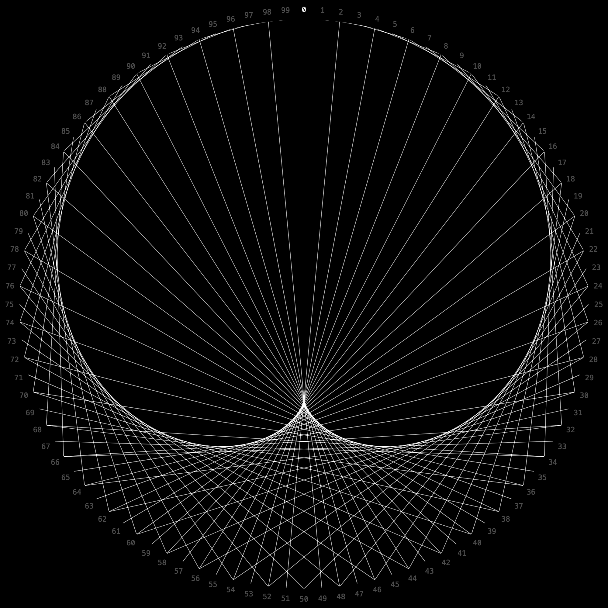
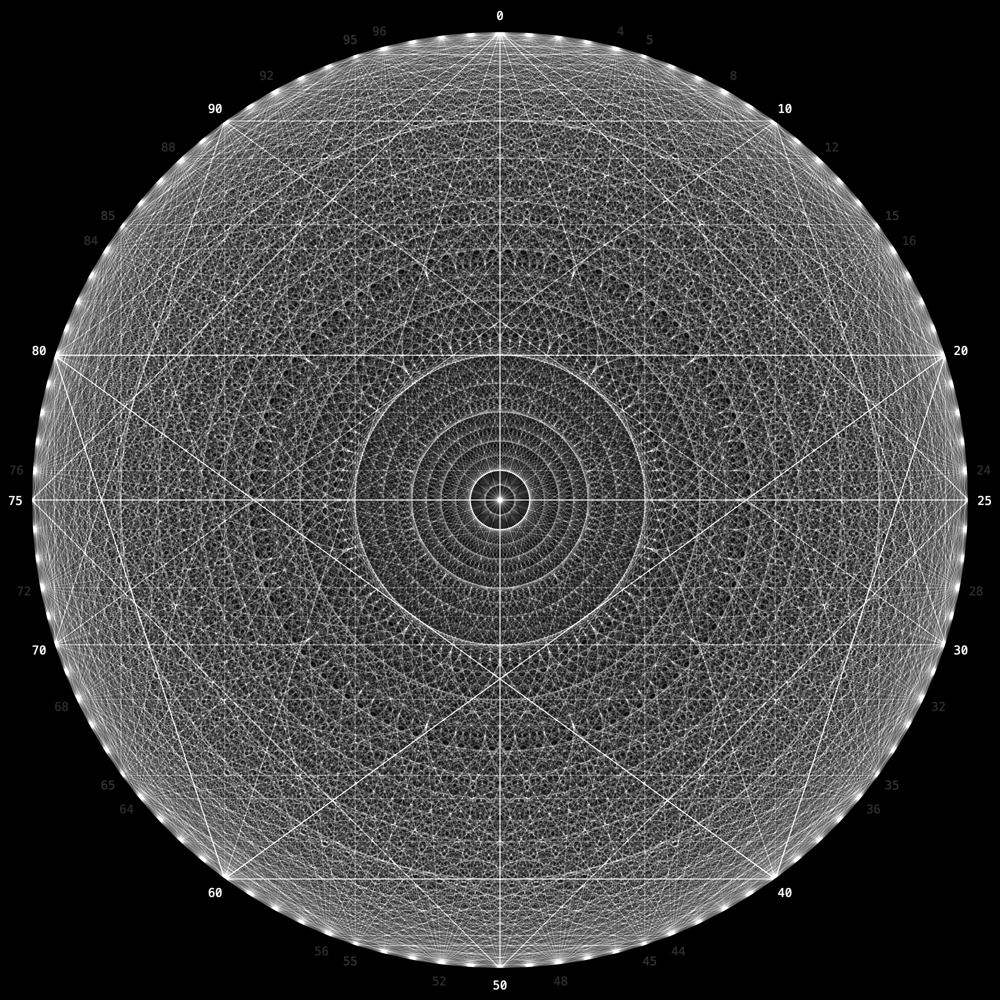

# Mircle
A website that generates line art by multiplying in a circle. [See it here](https://moarram.github.io/mircle/).

## How Does It Work?
The core concept is best explained by [Mathologer](https://www.youtube.com/watch?v=qhbuKbxJsk8), whose video inspired this whole project.

To summarize, arrange `n` vertices in order around a circle. Choose some multiplier `m`. For each vertex `v`, multiply it by `m` and apply modulo `n` to get a new vertex `v2`. That is, `v2 = (v * m) mod n`. Draw a line between these vertices. The resulting graph has exactly `n` lines.

> 
>
> Example showing 100 vertices with multiplier 2.

That's all been done before, but what if we layer a bunch of these graphs over each other? Let's restrict `m` to integers less than `n`. For each `m`, compute the graph as before, but keep track of repeated lines. As more layers define the same line, draw it more prominently.
> 
>
> Example showing 100 vertices with all 100 layers stacked.

To further accentuate the patterns, we can use color, opacity, and width to individually style each line. Add a few gradients and we have art!

> 
>
> Example showing the same graph with styles applied.

Thus we can visualize the inherent beauty of numbers and multiplication.

## Browser Compatibility
Slight variations between browsers in their implementation of the HTML5 canvas may cause the image to render differently. And in the case of Safari, different to the point of not working :(

| Chrome | Firefox | Safari (broken) |
|--------|---------|-----------------|
|  |  |  |
